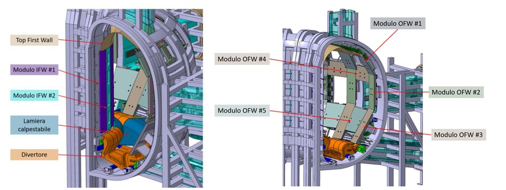
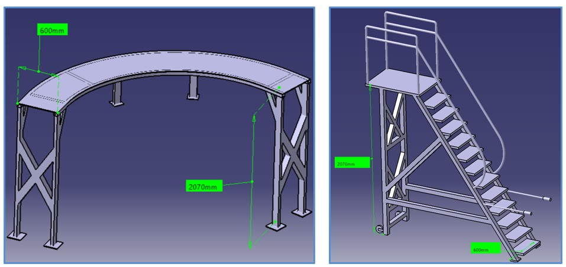
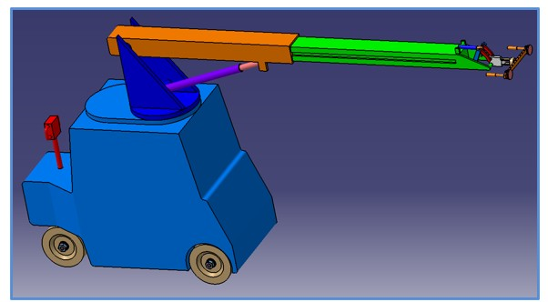
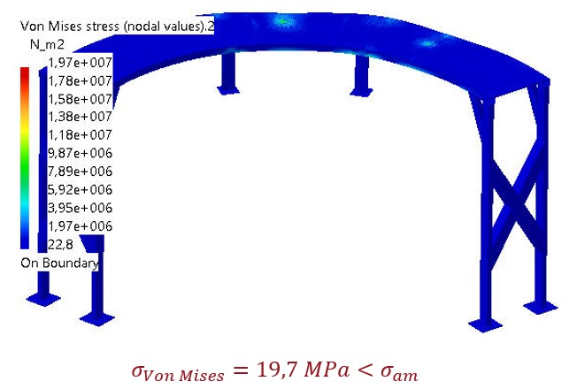
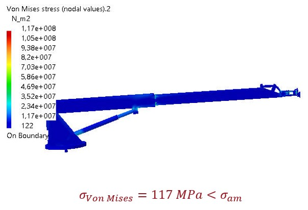
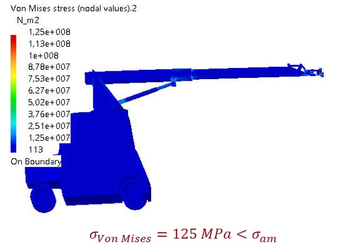
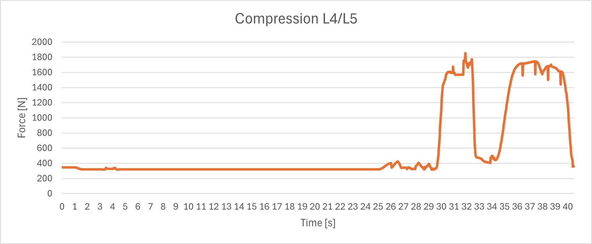
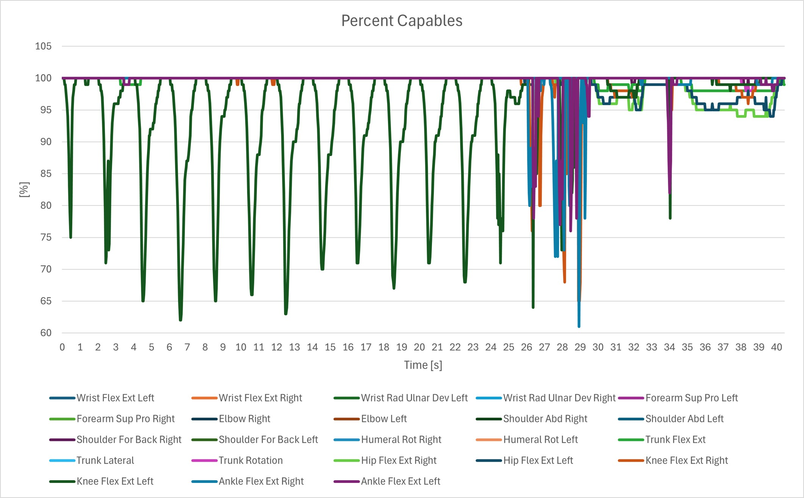

# RH_FACILITY_INSTALLATION_TOOL
Il progetto consiste nella Prototipazione Virtuale del sistema di attrezzature ausiliarie che fungano da supporto agli operatori della RH Facility nella movimentazione dei moduli Inboard First Wall ed Outboard First Wall soddisfacendo determinati requisiti.

  
  
<em>CIMA Reactions and Empirical Rate Laws</em>

La soluzione proposta è stata:
- modellata in **CATIA V5**
- sottoposta ad una analisi **FEM**
- **Simulazione cinematica** per il test di configurazioni critiche
- Analisi **ergonomica** tramite **Siemens Jack**
  
Il report completo è disponibile [qui](./PV2324_PROGETTO_PERFETTA-ROMANO.pdf).

## Idea
Per consentire l’accesso all’ambiente dei mockup, l’operatore può avvalersi di una passerella a cui è collegata una scala a castello. Mentre per manovrare in sicurezza i moduli IFW ed OFW, è stato realizzato un sistema costituito da un manipolatore allungabile con supporto mobile similare ad un manipolatore per vetri. 

  
  
<em>Passerella + Scala a Castello</em>

  
  
<em>Manipolatore con Supporto Mobile</em>

## Analisi FEM
### Passerella
La passerella è stata realizzata in Alluminio e, tramite l'analisi FEM, sono state verificate le specifiche richieste.

  
  
<em>Analisi FEM - Passerella</em>

### Scala
La scala è stata realizzata in Alluminio e, tramite l'analisi FEM, sono state verificate le specifiche richieste.

  
  
<em>Analisi FEM - Scala</em>

### Manipolatore
Il Manipolatore è stato realizzato in Acciaio e, tramite l'analisi FEM, sono state verificate le specifiche richieste e sono state ricavate le infomazioni necessarie per modellare il cuscinetto assiale tra Supporto Mobile e Manipolatore.

  
  
<em>Analisi FEM - Manipolatore</em>

### Supporto Mobile con Manipolatore 
Il Supporto Mobile con Manipolatore è stato realizzato in Acciaio e, tramite l'analisi FEM, le specifiche richieste risultano soddisfatte.

  
  
<em>Analisi FEM - Supporto Mobile con Manipolatore </em>

## Analisi ergonomica 
L'analisi ergonomica è stata realizzata con il software Jack con l'utilizzo di modelli umani di default (uomo ed una donna caucasici del 50esimo percentile) con un avvitatore di 1.5 kg. In particolare sono state effettuate varie tipologie di analisi, di seguito è riportata i risultati del montaggio del modulo OFW in basso. 
Le coppie sulle vertebre L4/L5 rimangono al di sotto del valore critico 3400 N.

  
  
<em>Analisi in Jack - Coppie sulle vertebre L4/L5  </em>

Gli angolo più critici sono raggiungibili dal 60esimo percentile della popolazione

  
  
<em>Analisi in Jack  </em>

