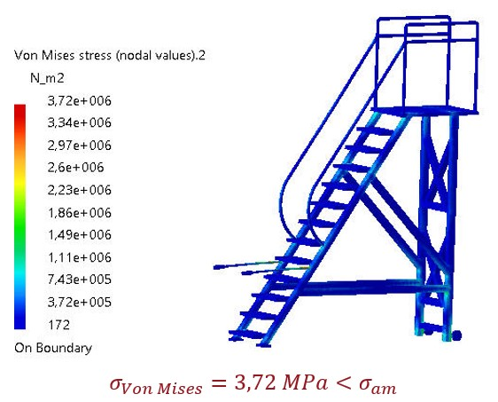

# RH_FACILITY_INSTALLATION_TOOL
Il progetto consiste nella Prototipazione Virtuale del sistema di attrezzature ausiliarie che fungano da supporto agli operatori della RH Facility nella movimentazione dei moduli Inboard First Wall ed Outboard First Wall soddisfacendo determinati requisiti.

  
  
<em>CIMA Reactions and Empirical Rate Laws</em>

La soluzione proposta è stata:
- modellata in **CATIA V5**
- sottoposta ad una analisi **FEM**
- **Simulazione cinematica** per il test di configurazioni critiche
- Analisi **ergonomica** tramite **Siemens Jack**
  
Il report completo è disponibile [qui](./PV2324_PROGETTO_PERFETTA-ROMANO.pdf).

## Idea
Per consentire l’accesso all’ambiente dei mockup, l’operatore può avvalersi di una passerella a cui è collegata una scala a castello. Mentre per manovrare in sicurezza i moduli IFW ed OFW, è stato realizzato un sistema costituito da un manipolatore allungabile con supporto mobile similare ad un manipolatore per vetri. 

  
  
<em>Passerella + Scala a Castello</em>

  
  
<em>Manipolatore con Supporto Mobile</em>

## Analisi FEM
### Passerella
La passerella è stata realizzata in Alluminio e, tramite l'analisi FEM, sono state verificate le specifiche richieste.

  
  
<em>Analisi FEM - Passerella</em>

### Scala
La scala è stata realizzata in Alluminio e, tramite l'analisi FEM, sono state verificate le specifiche richieste.

  
  
<em>Analisi FEM - Scala</em>

### Manipolatore
Il Manipolatore è stato realizzato in Acciaio e, tramite l'analisi FEM, sono state verificate le specifiche richieste e sono state ricavate le infomazioni necessarie per modellare il cuscinetto assiale tra Supporto Mobile e Manipolatore.

  
  
<em>Analisi FEM - Manipolatore</em>

### Supporto Mobile con Manipolatore 
Il Supporto Mobile con Manipolatore è stato realizzato in Acciaio e, tramite l'analisi FEM, le specifiche richieste risultano soddisfatte.

  
  
<em>Analisi FEM - Supporto Mobile con Manipolatore </em>

## Analisi ergonomica 
L'analisi ergonomica è stata realizzata con il software Jack con l'utilizzo di modelli umani di default (uomo ed una donna caucasici del 50esimo percentile) con un avvitatore di 1.5 kg. In particolare sono state effettuate varie tipologie di analisi, di seguito è riportata i risultati del montaggio del modulo OFW in basso. 
Le coppie sulle vertebre L4/L5 rimangono al di sotto del valore critico 3400 N.

  
  
<em>Analisi in Jack - Coppie sulle vertebre L4/L5  </em>

Gli angolo più critici sono raggiungibili dal 60esimo percentile della popolazione

  
  
<em>Analisi in Jack  </em>

***

# RH_FACILITY_INSTALLATION_TOOL

This project involves the **Virtual Prototyping** of auxiliary equipment systems designed to support operators at the RH Facility in handling the Inboard First Wall (IFW) and Outboard First Wall (OFW) modules, meeting specific requirements.

  
  
<em>CIMA Reactions and Empirical Rate Laws</em>

The proposed solution includes:
- Modeled in **CATIA V5**
- Underwent **FEM analysis**
- **Kinematic simulation** for testing critical configurations
- **Ergonomic analysis** with **Siemens Jack**

The full report is available [here](./PV2324_PROGETTO_PERFETTA-ROMANO.pdf).

## Idea
To allow access to the mockup environment, operators can use a catwalk with an attached ladder. For safe handling of the IFW and OFW modules, a system was designed consisting of an extendable manipulator with a mobile support, similar to a glass manipulator.

  
  
<em>Catwalk + Ladder</em>

  
  
<em>Manipulator with Mobile Support</em>

## FEM Analysis

### Catwalk
The catwalk is made of aluminum and its specifications were verified through **FEM analysis**.

  
  
<em>FEM Analysis - Catwalk</em>

### Ladder
The ladder is made of aluminum, and its specifications were verified using **FEM analysis**.

  
  
<em>FEM Analysis - Ladder</em>

### Manipulator
The manipulator is made of steel, and its specifications were verified through **FEM analysis**. Necessary information for modeling the axial bearing between the Mobile Support and Manipulator was also derived.

  
  
<em>FEM Analysis - Manipulator</em>

### Mobile Support with Manipulator
The Mobile Support with Manipulator is made of steel, and its specifications meet the required standards, verified through **FEM analysis**.

  
  
<em>FEM Analysis - Mobile Support with Manipulator</em>

## Ergonomic Analysis
The ergonomic analysis was performed using **Siemens Jack**, with default human models (Caucasian male and female, 50th percentile) and a 1.5 kg screwdriver. Several types of analyses were conducted, with results from the assembly of the OFW module at the bottom shown below.
The torque on the L4/L5 vertebrae remained below the critical value of 3400 N.

  
  
<em>Jack Analysis - Torque on L4/L5 Vertebrae</em>

The most critical angles are achievable by the 60th percentile of the population.

  
  
<em>Jack Analysis</em>

